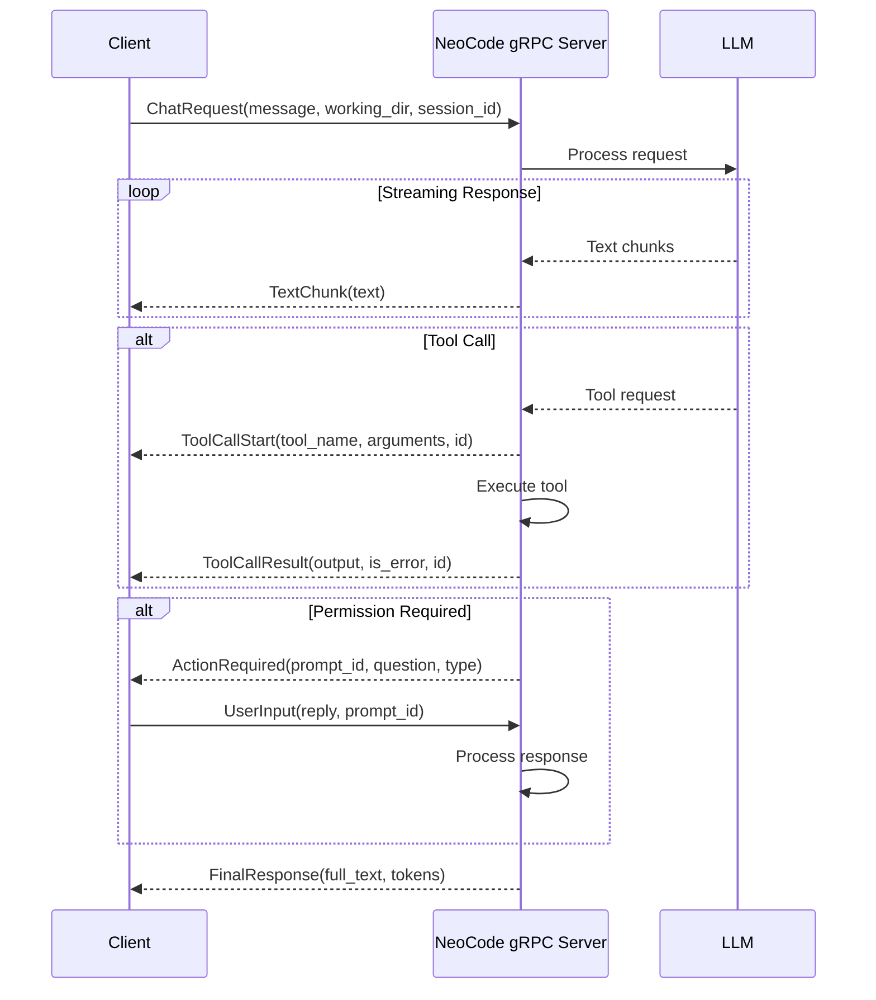

# NeoCode API & Integration Guide

Complete guide for integrating with NeoCode, building plugins, and using the gRPC API.

---

## Table of Contents

- [gRPC API](#grpc-api)
- [Plugin Development](#plugin-development)
- [MCP Server Integration](#mcp-server-integration)
- [Custom Tools](#custom-tools)
- [Custom Commands](#custom-commands)
- [Hooks System](#hooks-system)
- [Provider Integration](#provider-integration)
- [VS Code Extension](#vs-code-extension)

---

## gRPC API

NeoCode can run as a headless gRPC server for integration with other applications.

### Starting the Server

```bash
npm run dev:grpc
```

**Default:** `localhost:50051`

**Environment Variables:**

| Variable | Default | Description |
|----------|---------|-------------|
| `GRPC_PORT` | `50051` | Port to listen on |
| `GRPC_HOST` | `localhost` | Bind address (use `0.0.0.0` to expose, not recommended without auth) |

### Proto Definition

**Location:** `src/proto/neocode.proto`

### Service Definition

```protobuf
service AgentService {
  // Bidirectional streaming RPC
  rpc Chat(stream ClientMessage) returns (stream ServerMessage);
}
```

### Message Types

#### Client Messages (Input)

**`ClientMessage`** - Main client message wrapper

```protobuf
message ClientMessage {
  oneof payload {
    ChatRequest request = 2;      // Initial request
    UserInput input = 3;          // Response to prompt
    CancelSignal cancel = 4;      // Stop generation
  }
}
```

**`ChatRequest`** - Start a new chat

```protobuf
message ChatRequest {
  string message = 1;             // User prompt
  string working_directory = 2;   // Working directory for commands
  optional string model = 4;      // Override model
  string session_id = 5;          // Session ID for persistence
}
```

**`UserInput`** - Respond to agent prompt

```protobuf
message UserInput {
  string reply = 1;               // Response text (e.g., "y", "no")
  string prompt_id = 2;           // ID of the prompt being answered
}
```

**`CancelSignal`** - Cancel current generation

```protobuf
message CancelSignal {
  string reason = 1;              // Cancellation reason
}
```

#### Server Messages (Output)

**`ServerMessage`** - Main server message wrapper

```protobuf
message ServerMessage {
  oneof event {
    TextChunk text_chunk = 1;           // Text from LLM
    ToolCallStart tool_start = 2;       // Tool execution started
    ToolCallResult tool_result = 3;     // Tool execution result
    ActionRequired action_required = 4; // User input needed
    FinalResponse done = 5;             // Generation complete
    ErrorResponse error = 6;            // Error occurred
  }
}
```

**`TextChunk`** - Streaming text output

```protobuf
message TextChunk {
  string text = 1;                // Text chunk
}
```

**`ToolCallStart`** - Tool execution started

```protobuf
message ToolCallStart {
  string tool_name = 1;           // Tool name (e.g., "BashTool")
  string arguments_json = 2;      // JSON arguments
  string tool_use_id = 3;         // Correlation ID
}
```

**`ToolCallResult`** - Tool execution result

```protobuf
message ToolCallResult {
  string tool_name = 1;           // Tool name
  string output = 2;              // stdout/stderr or result
  bool is_error = 3;              // Error flag
  string tool_use_id = 4;         // Correlation ID
}
```

**`ActionRequired`** - User input needed

```protobuf
message ActionRequired {
  string prompt_id = 1;           // Client must return this ID
  string question = 2;            // Question text
  enum ActionType {
    CONFIRM_COMMAND = 0;          // Yes/No confirmation
    REQUEST_INFORMATION = 1;      // Text input
  }
  ActionType type = 3;
}
```

**`FinalResponse`** - Generation complete

```protobuf
message FinalResponse {
  string full_text = 1;           // Complete generated text
  int32 prompt_tokens = 2;        // Input tokens used
  int32 completion_tokens = 3;    // Output tokens used
}
```

**`ErrorResponse`** - Error occurred

```protobuf
message ErrorResponse {
  string message = 1;             // Error message
  string code = 2;                // Error code
}
```

### Example Flow



### Client Example (Node.js)

```javascript
const grpc = require('@grpc/grpc-js');
const protoLoader = require('@grpc/proto-loader');

// Load proto
const packageDefinition = protoLoader.loadSync('src/proto/neocode.proto');
const proto = grpc.loadPackageDefinition(packageDefinition).neocode.v1;

// Connect to server
const client = new proto.AgentService(
  'localhost:50051',
  grpc.credentials.createInsecure()
);

// Start bidirectional stream
const stream = client.Chat();

// Send initial request
stream.write({
  request: {
    message: 'What files are in this directory?',
    working_directory: process.cwd(),
    session_id: 'my-session-123'
  }
});

// Handle server messages
stream.on('data', (message) => {
  if (message.text_chunk) {
    process.stdout.write(message.text_chunk.text);
  } else if (message.tool_start) {
    console.log(`\n[Tool: ${message.tool_start.tool_name}]`);
  } else if (message.tool_result) {
    console.log(`[Result: ${message.tool_result.output}]`);
  } else if (message.action_required) {
    // Prompt user for input
    const readline = require('readline').createInterface({
      input: process.stdin,
      output: process.stdout
    });
    readline.question(message.action_required.question + ' ', (answer) => {
      stream.write({
        input: {
          reply: answer,
          prompt_id: message.action_required.prompt_id
        }
      });
      readline.close();
    });
  } else if (message.done) {
    console.log(`\n\nDone! Tokens: ${message.done.prompt_tokens} + ${message.done.completion_tokens}`);
    stream.end();
  } else if (message.error) {
    console.error(`Error: ${message.error.message}`);
    stream.end();
  }
});

stream.on('end', () => {
  console.log('Stream ended');
});
```

### Client Example (Python)

```python
import grpc
from neocode_pb2 import ClientMessage, ChatRequest, UserInput
from neocode_pb2_grpc import AgentServiceStub

# Connect to server
channel = grpc.insecure_channel('localhost:50051')
stub = AgentServiceStub(channel)

# Generator for client messages
def generate_messages():
    # Initial request
    yield ClientMessage(
        request=ChatRequest(
            message="List files in this directory",
            working_directory=".",
            session_id="python-session-123"
        )
    )

    # User can send more messages (UserInput, CancelSignal) as needed

# Start streaming
responses = stub.Chat(generate_messages())

# Handle server responses
for response in responses:
    if response.HasField('text_chunk'):
        print(response.text_chunk.text, end='', flush=True)
    elif response.HasField('tool_start'):
        print(f"\n[Tool: {response.tool_start.tool_name}]")
    elif response.HasField('tool_result'):
        print(f"[Result: {response.tool_result.output}]")
    elif response.HasField('action_required'):
        # TODO: Prompt user for input
        pass
    elif response.HasField('done'):
        print(f"\n\nDone! Tokens: {response.done.prompt_tokens} + {response.done.completion_tokens}")
        break
    elif response.HasField('error'):
        print(f"Error: {response.error.message}")
        break
```

---

## Plugin Development

NeoCode supports plugins to extend functionality.

### Plugin Structure

```typescript
interface Plugin {
  name: string;
  version: string;
  description?: string;

  // Optional lifecycle hooks
  onLoad?(): Promise<void>;
  onUnload?(): Promise<void>;

  // Provide MCP servers
  mcpServers?: MCPServer[];

  // Provide custom tools
  tools?: Tool[];

  // Provide custom commands
  commands?: Command[];

  // Provide custom skills
  skills?: Skill[];

  // Provide themes
  themes?: Theme[];
}
```

### Creating a Plugin

**Example:** Simple notification plugin

```typescript
// plugins/neocode-notify/index.ts

import { Plugin } from '@neocode/sdk';

export default class NotifyPlugin implements Plugin {
  name = 'neocode-notify';
  version = '1.0.0';
  description = 'Send notifications via Telegram';

  async onLoad() {
    console.log('NotifyPlugin loaded');
  }

  async onUnload() {
    console.log('NotifyPlugin unloaded');
  }

  // Provide MCP server for notifications
  mcpServers = [{
    name: 'telegram',
    command: 'node',
    args: ['./servers/telegram.js'],
    env: {
      TELEGRAM_BOT_TOKEN: process.env.TELEGRAM_BOT_TOKEN
    }
  }];

  // Provide custom command
  commands = [{
    name: 'notify',
    description: 'Send a notification',
    handler: async (args) => {
      // Implementation
      await sendNotification(args.message);
    }
  }];
}
```

### Plugin Registration

**Location:** `src/plugins/builtinPlugins.ts` (for built-in plugins)

**User Plugins:** `~/.neocode/plugins/` (planned)

---

## MCP Server Integration

Model Context Protocol (MCP) allows external tools to be integrated.

### MCP Server Configuration

**Location:** `~/.claude/settings.json`

```json
{
  "mcpServers": {
    "filesystem": {
      "command": "node",
      "args": ["path/to/filesystem-server.js"],
      "disabled": false
    },
    "database": {
      "command": "python",
      "args": ["path/to/database-server.py"],
      "env": {
        "DB_CONNECTION": "postgresql://..."
      }
    }
  }
}
```

### Creating an MCP Server

**Example:** Simple file search server

```typescript
// servers/file-search.ts

import { Server } from '@modelcontextprotocol/sdk/server/index.js';
import { StdioServerTransport } from '@modelcontextprotocol/sdk/server/stdio.js';
import { CallToolRequestSchema, ListToolsRequestSchema } from '@modelcontextprotocol/sdk/types.js';

const server = new Server({
  name: 'file-search-server',
  version: '1.0.0'
}, {
  capabilities: {
    tools: {}
  }
});

// List available tools
server.setRequestHandler(ListToolsRequestSchema, async () => {
  return {
    tools: [{
      name: 'search_files',
      description: 'Search for files matching a pattern',
      inputSchema: {
        type: 'object',
        properties: {
          pattern: {
            type: 'string',
            description: 'Glob pattern to search for'
          }
        },
        required: ['pattern']
      }
    }]
  };
});

// Handle tool calls
server.setRequestHandler(CallToolRequestSchema, async (request) => {
  if (request.params.name === 'search_files') {
    const { pattern } = request.params.arguments;
    // Implementation
    const files = await searchFiles(pattern);
    return {
      content: [{
        type: 'text',
        text: JSON.stringify(files, null, 2)
      }]
    };
  }
  throw new Error(`Unknown tool: ${request.params.name}`);
});

// Start server
async function main() {
  const transport = new StdioServerTransport();
  await server.connect(transport);
}

main().catch(console.error);
```

### Enable MCP Server

```
/mcp enable file-search
```

---

## Custom Tools

Create custom tools for NeoCode to use.

### Tool Interface

```typescript
interface Tool {
  name: string;
  description: string;
  input_schema: JSONSchema;
  execute(params: any): Promise<ToolResult>;
}
```

### Example: Custom Database Tool

```typescript
// tools/DatabaseTool.ts

import { Tool, ToolResult } from '../Tool';

export class DatabaseTool extends Tool {
  name = 'database_query';
  description = 'Execute a SQL query on the database';

  input_schema = {
    type: 'object',
    properties: {
      query: {
        type: 'string',
        description: 'SQL query to execute'
      }
    },
    required: ['query']
  };

  async execute(params: { query: string }): Promise<ToolResult> {
    const { query } = params;

    try {
      const results = await executeQuery(query);
      return {
        success: true,
        output: JSON.stringify(results, null, 2)
      };
    } catch (error) {
      return {
        success: false,
        error: error.message
      };
    }
  }
}
```

### Register Tool

**Location:** `src/tools.ts`

```typescript
import { DatabaseTool } from './tools/DatabaseTool';

export const tools = [
  // Existing tools...
  new DatabaseTool()
];
```

---

## Custom Commands

Create custom slash commands.

### Simple Command (Markdown)

**Location:** `.claude/commands/test.md`

```markdown
Run the full test suite with coverage reporting
```

**Usage:**
```
/test
```

### Advanced Command (TypeScript)

**Location:** `src/commands/custom/index.ts`

```typescript
import { Command } from '../Command';

export const customCommand: Command = {
  name: 'custom',
  description: 'Custom command example',

  async execute(args: string[], context: CommandContext) {
    const { appStateStore } = context;

    // Custom logic
    console.log('Executing custom command with args:', args);

    // Update state
    appStateStore.setState({
      customData: 'value'
    });

    return 'Custom command completed';
  }
};
```

### Register Command

**Location:** `src/commands.ts`

```typescript
import { customCommand } from './commands/custom';

export const commands = {
  // Existing commands...
  custom: customCommand
};
```

---

## Hooks System

Configure lifecycle hooks for automation.

### Hook Configuration

**Location:** `~/.claude/settings.json`

```json
{
  "hooks": {
    "beforeToolCall": {
      "bash": "echo 'Running: {command}' >> audit.log"
    },
    "afterWrite": {
      "*": "bun run lint {filePath}"
    },
    "beforeBash": {
      "*": "echo 'Executing bash command'"
    },
    "afterBash": {
      "*": "echo 'Bash command completed'"
    }
  }
}
```

### Available Hooks

| Hook | Trigger | Context Variables |
|------|---------|------------------|
| `beforeToolCall` | Before any tool execution | `{toolName}`, `{params}` |
| `afterToolCall` | After tool execution | `{toolName}`, `{result}` |
| `beforeWrite` | Before file write | `{filePath}`, `{content}` |
| `afterWrite` | After file write | `{filePath}` |
| `beforeBash` | Before bash command | `{command}` |
| `afterBash` | After bash command | `{command}`, `{exitCode}` |

### Hook Examples

**Auto-format on Write:**
```json
{
  "hooks": {
    "afterWrite": {
      "*.ts": "prettier --write {filePath}",
      "*.py": "black {filePath}"
    }
  }
}
```

**Audit Logging:**
```json
{
  "hooks": {
    "beforeBash": {
      "*": "echo '[AUDIT] {command}' >> ~/neocode-audit.log"
    }
  }
}
```

---

## Provider Integration

Add custom AI provider support.

### Provider Interface

```typescript
interface Provider {
  name: string;
  createClient(config: ProviderConfig): ProviderClient;
}

interface ProviderClient {
  chat(messages: Message[], tools: Tool[]): AsyncGenerator<Response>;
}
```

### Example: Custom Provider

```typescript
// services/api/customProvider.ts

export class CustomProvider {
  name = 'custom';

  createClient(config: ProviderConfig) {
    return {
      async *chat(messages, tools) {
        const response = await fetch(config.baseURL + '/chat', {
          method: 'POST',
          headers: {
            'Authorization': `Bearer ${config.apiKey}`,
            'Content-Type': 'application/json'
          },
          body: JSON.stringify({
            messages,
            tools,
            model: config.model
          })
        });

        // Stream response
        const reader = response.body.getReader();
        while (true) {
          const { done, value } = await reader.read();
          if (done) break;

          // Parse and yield chunks
          yield parseChunk(value);
        }
      }
    };
  }
}
```

---

## VS Code Extension

NeoCode includes a VS Code extension for integration.

### Extension Location

`vscode-extension/neocode-vscode/`

### Extension Features

- Launch NeoCode from VS Code
- Provider-aware UI
- Theme support
- gRPC integration

### Extension API

```typescript
// extension.js

const vscode = require('vscode');
const grpc = require('@grpc/grpc-js');

function activate(context) {
  // Register command
  let disposable = vscode.commands.registerCommand(
    'neocode.launch',
    async () => {
      // Launch NeoCode gRPC server
      const terminal = vscode.window.createTerminal('NeoCode');
      terminal.sendText('npm run dev:grpc');

      // Connect to gRPC
      // ...
    }
  );

  context.subscriptions.push(disposable);
}

exports.activate = activate;
```

---

## API Reference Summary

| Integration Type | Complexity | Use Case |
|-----------------|------------|----------|
| **gRPC API** | Medium | External applications, CI/CD, custom UIs |
| **Plugins** | Medium | Bundled extensions, official add-ons |
| **MCP Servers** | Low | External tool integration |
| **Custom Tools** | Low | Domain-specific operations |
| **Custom Commands** | Low | Project-specific workflows |
| **Hooks** | Low | Automation, formatting, auditing |
| **Provider Integration** | High | New AI provider support |
| **VS Code Extension** | High | IDE integration |

---

## Examples Repository

For complete working examples, see:

- [NeoCode Examples](https://github.com/LHenri88/neocode-examples) (planned)
- `plugins/` directory (official plugins)
- `vscode-extension/` (VS Code integration)

---

## Support

- **Documentation:** [docs/](.)
- **Discussions:** [GitHub Discussions](https://github.com/LHenri88/NeoCode/discussions)
- **Issues:** [GitHub Issues](https://github.com/LHenri88/NeoCode/issues)
- **Contributing:** [CONTRIBUTING.md](../CONTRIBUTING.md)

---

**Happy Building!** 🚀
