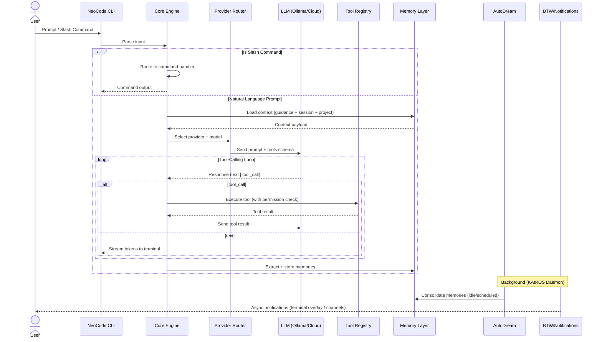
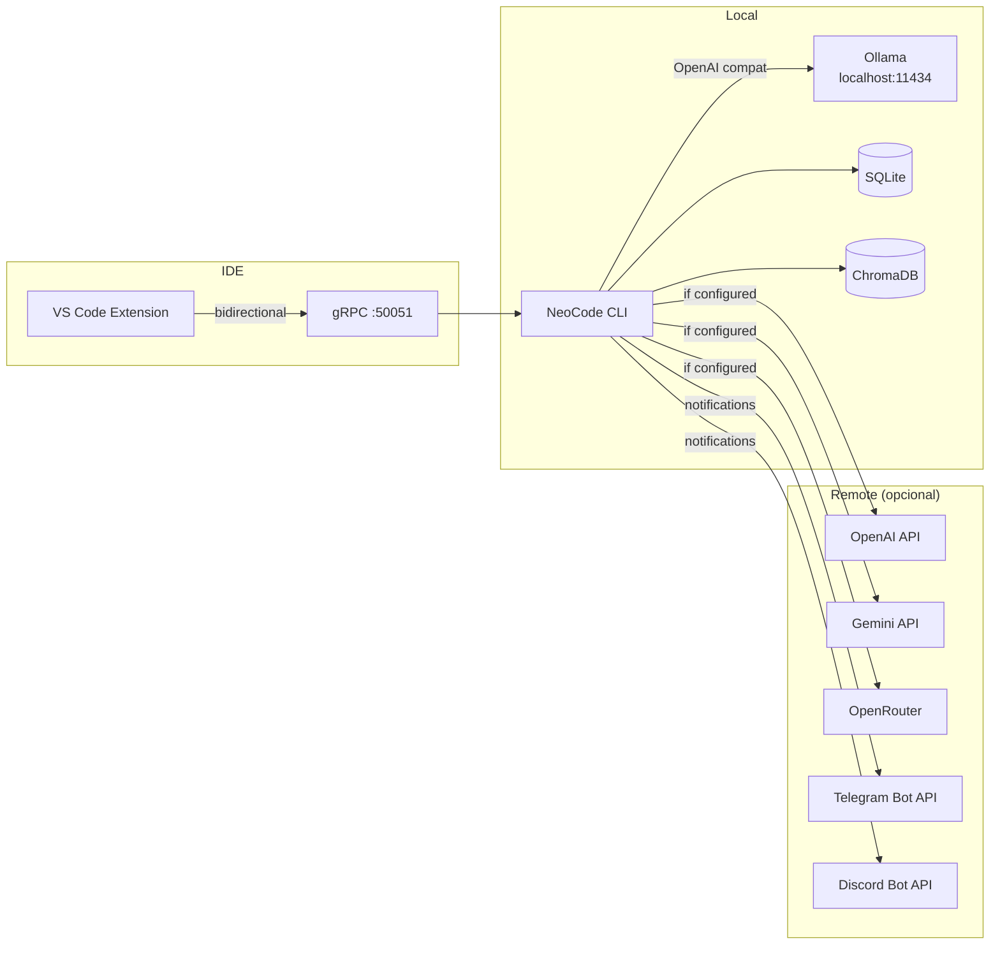

# 🏛️ Arquitetura — NeoCode v1.0

**Data:** 09 de Abril de 2026
**Autor:** Aria the Visionary (Architect Agent)
**Base:** Fork NeoCode v0.1.8 — 175+ arquivos TypeScript

---

## 1. Diagrama de Arquitetura

```mermaid
graph TB
    subgraph "Interface Layer"
        CLI["CLI + Slash Commands<br/>(Ink/React Terminal UI)<br/>🆕 Matrix Theme"]
        GRPC["gRPC Headless Server<br/>(src/grpc/ + proto/)"]
        VSCODE["VS Code Extension"]
        VOICE["Voice Input<br/>(src/voice/)"]
    end

    subgraph "Core Engine"
        MAIN["Main Loop<br/>(src/main.tsx)"]
        TOOL["Tool Registry<br/>(src/Tool.ts — 48+ tools)"]
        MCP["MCP Protocol<br/>(@modelcontextprotocol/sdk)"]
        PERM["Permission System<br/>(gates + callbacks)"]
        CMD["Command Registry<br/>(93+ slash commands)"]
    end

    subgraph "Provider Layer"
        ROUTER["Agent Routing<br/>(agentRouting.ts)"]
        OAI["OpenAI Shim"]
        CDX["Codex Shim"]
        PCONF["Provider Config"]
        OLLAMA["Ollama<br/>(LOCAL DEFAULT)"]
        CLOUD["Cloud APIs<br/>(OpenRouter, Gemini…)"]
    end

    subgraph "Tools Layer"
        BASH["Bash / PowerShell"]
        FILE["File R/W/Edit"]
        SEARCH["Grep/Glob/Web"]
        AGENT["AgentTool + Tasks"]
        COMPU["Computer Use<br/>(screenshot+mouse/kb)"]
        SKILL["SkillTool + MCPTool"]
        LSP["LSP Integration"]
    end

    subgraph "Orchestration Layer"
        COORD["Coordinator"]
        GUIDE["🆕 Guidance Agent"]
        SWARM["Hierarchical Swarm"]
    end

    subgraph "Memory Layer"
        MEMDIR["MemDir"]
        EXTRACT["Extract Memories"]
        SESSION["Session Memory"]
        PALACE["🆕 Memory Palace<br/>(Wings/Rooms)"]
        KG["🆕 Knowledge Graph<br/>(SQLite + ChromaDB)"]
    end

    subgraph "Self-Improvement Layer"
        DREAM["AutoDream"]
        REVIEW["🆕 AutoReview"]
        RESEARCH["🆕 AutoResearch"]
        ENHANCE["🆕 Prompt Enhance"]
        IMPROVE["🆕 Self-Improve Loop"]
    end

    subgraph "Daemon Layer — KAIROS 2.0"
        KAIROS["🆕 KAIROS Daemon"]
        BTW["BTW Async"]
        NOTIF["🆕 Notifications<br/>(Telegram/Discord)"]
        CRON["ScheduleCron"]
    end

    subgraph "Extensions"
        PLUGINS["Plugin System"]
        GIT["Git-native"]
        WIKI["Wiki"]
    end

    CLI --> MAIN
    GRPC --> MAIN
    VSCODE --> GRPC
    VOICE --> MAIN
    MAIN --> TOOL
    MAIN --> MCP
    MAIN --> PERM
    MAIN --> CMD
    TOOL --> ROUTER
    ROUTER --> OAI
    ROUTER --> CDX
    OAI --> OLLAMA
    OAI --> CLOUD
    TOOL --> BASH & FILE & SEARCH & AGENT & COMPU & SKILL & LSP
    MAIN --> COORD
    COORD --> GUIDE & SWARM
    MAIN --> MEMDIR
    MEMDIR --> EXTRACT & SESSION & PALACE
    PALACE --> KG
    DREAM --> MEMDIR
    KAIROS --> DREAM & BTW & NOTIF & CRON
    PLUGINS --> TOOL & CMD
```



---

## 2. Fluxo de Dados Principal



---

## 3. Decisões Arquiteturais (ADRs)

### ADR-01: Manter TypeScript + React/Ink
- **Decisão:** NÃO migrar para Rust
- **Justificativa:** Codebase maduro (175+ files). Migrar custaria meses sem ROI. Computer Use já funciona via Node FFI.
- **Tradeoff:** Performance é boa o suficiente para CLI. Binary size aceitável via `bun build`.

### ADR-02: ChromaDB + SQLite para Knowledge Graph
- **Decisão:** Usar ChromaDB (embeddings) + SQLite (relações) ao invés de só arquivos `.md`
- **Justificativa:** Busca semântica requer vetores. SQLite é zero-config. `project-memory.md` mantido para compat.
- **Tradeoff:** +20MB no runtime.

### ADR-03: Notificações via Plugins MCP
- **Decisão:** Telegram/Discord/WhatsApp como plugins MCP, não core
- **Justificativa:** MCP já suporta tools externos. Mantém core leve. Permite extensão pela comunidade.
- **Tradeoff:** Telegram pode ser bundled como "official plugin".

### ADR-04: Remover deps Anthropic-proprietárias
- **Decisão:** Remover `@anthropic-ai/bedrock-sdk`, `foundry-sdk`, `@growthbook/growthbook`
- **Justificativa:** Privacy-first. Manter `@anthropic-ai/sdk` para quem quiser Claude como provider.

### ADR-05: KAIROS como child_process
- **Decisão:** KAIROS roda como `child_process.fork()`, não daemon separado
- **Justificativa:** Simplicidade de instalação. Funciona em Windows sem systemd.
- **Tradeoff:** Morre quando CLI fecha. Aceitável para v1.0.

### ADR-06: 🆕 Matrix Visual Theme via Ink + chalk
- **Decisão:** Implementar visual Matrix-inspired usando Ink components + chalk ANSI colors
- **Justificativa:** Diferenciação visual no mercado. Ink já suporta animações. Zero deps adicionais.
- **Tradeoff:** Configurável — usuário pode desabilitar com `/theme minimal`.

---

## 4. Mapa de Diretórios

```
neocode/
├── bin/neocode                         # Entry point (renomeado)
├── src/
│   ├── main.tsx                        # Main loop
│   ├── Tool.ts                         # Tool base class
│   ├── tools/                          # 48+ tools (existentes)
│   ├── commands/                       # 93+ slash commands
│   │   ├── btw/                        # BTW (aprimorar)
│   │   ├── dream/                      # Dream command
│   │   ├── memory/                     # Memory command
│   │   └── theme/                      # 🆕 Theme switching
│   ├── services/
│   │   ├── api/                        # Provider layer
│   │   ├── autoDream/                  # AutoDream
│   │   ├── extractMemories/            # Memory extraction
│   │   ├── SessionMemory/              # Session memory
│   │   ├── mcp/                        # MCP protocol
│   │   ├── compact/                    # Context compaction
│   │   ├── autoReview/                 # 🆕 AutoReview
│   │   ├── autoResearch/              # 🆕 AutoResearch
│   │   ├── guidanceAgent/             # 🆕 Guidance Agent
│   │   ├── memoryPalace/              # 🆕 Memory Palace
│   │   ├── knowledgeGraph/            # 🆕 Knowledge Graph
│   │   ├── promptEnhance/             # 🆕 Prompt Enhance
│   │   ├── selfImprove/               # 🆕 Self-Improve
│   │   ├── kairos/                    # 🆕 KAIROS daemon
│   │   └── notifications/            # 🆕 Channel notifications
│   ├── theme/                         # 🆕 Matrix Design System
│   │   ├── tokens.ts                  # Design tokens
│   │   ├── animations.ts             # Matrix rain, spinners
│   │   ├── components/               # StatusBar, Splash, Spinner
│   │   └── presets.ts                # Theme presets
│   ├── utils/computerUse/             # Computer Use
│   ├── memdir/                        # Memory directory
│   ├── grpc/                          # gRPC server
│   ├── skills/                        # Skills system
│   ├── voice/                         # Voice input
│   └── components/                    # UI components (156+ existentes)
├── plugins/                           # 🆕 Official plugins
│   ├── neocode-telegram/
│   ├── neocode-discord/
│   └── neocode-whatsapp/
├── scripts/
│   ├── build.ts
│   └── install.sh                     # 🆕 Installer
├── docs/
│   ├── PRD.md
│   ├── ARCHITECTURE.md                # Este arquivo
│   ├── EPICS.md
│   ├── DESIGN_SYSTEM.md
│   └── setup guides/
└── .neocode/                          # 🆕 Project config
    ├── guidance.md
    ├── kairos.yaml
    └── memory/
```

---

## 5. Integrações e Comunicação



---

## 6. Segurança

### Princípios
1. **Zero telemetria por padrão** — verificável via `bun run verify:privacy`
2. **Permission gates** em todas as tool executions
3. **Sandbox** para Computer Use (screenshot/input requerem aprovação)
4. **Audit log** persistente de todas as ações
5. **Sem credenciais hardcoded** — tudo via env vars ou config files com chmod 600

### Modelo de Permissões

```
┌─────────────────────────────────────────┐
│            Permission Levels            │
├─────────────────────────────────────────┤
│  🔴 BLOCK   │ Computer Use: click/type │
│  🟡 ASK     │ File write, Bash exec    │
│  🟢 AUTO    │ File read, Grep, Search  │
│  ⚡ YOLO    │ Everything (per-session)  │
└─────────────────────────────────────────┘
```

---

> 📎 **Documentos relacionados:**
> - [PRD](./PRD.md)
> - [Epics & Stories](./EPICS.md)
> - [Design System](./DESIGN_SYSTEM.md)
