# 🎨 Design System — NeoCode CLI

**Data:** 09 de Abril de 2026
**Autora:** Uma the Empathizer (UX Design Expert Agent)
**Inspiração:** The Matrix · Cyberpunk · Hacker Aesthetic
**Framework:** React 19 + Ink (Terminal UI) + chalk (ANSI colors)

---

## Referência Visual

> Mockups gerados via AI — ver `docs/mockups/` para referência visual.

---

## 1. Design Tokens

### 1.1 Paleta de Cores

```typescript
// src/theme/tokens.ts

export const colors = {
  // === CORE MATRIX PALETTE ===
  bg: {
    primary:    '#0a0a0a',   // Fundo principal (quase preto)
    secondary:  '#0d1117',   // Fundo de blocos/cards
    tertiary:   '#161b22',   // Fundo do status bar
    overlay:    '#00000099', // Overlay BTW (com transparência)
  },

  green: {
    bright:     '#00ff41',   // Matrix green — texto principal, cursor
    medium:     '#00cc33',   // Texto secundário, borders
    dim:        '#008f11',   // Texto terciário, comentários
    glow:       '#00ff4180', // Glow effect (50% opacity)
    dark:       '#003b00',   // Background sutil de seleção
  },

  accent: {
    cyan:       '#00d4ff',   // Links, referências, URLs
    amber:      '#ffb000',   // Warnings, atenção
    red:        '#ff3333',   // Erros, deletions
    purple:     '#bf5af2',   // BTW messages, async
    white:      '#e6edf3',   // Texto de alta prioridade
  },

  syntax: {
    keyword:    '#00ff41',   // function, const, if
    string:     '#00cc33',   // 'strings'
    number:     '#00d4ff',   // 42, 3.14
    comment:    '#008f11',   // // comments
    error:      '#ff3333',   // erros
    added:      '#00ff41',   // diff +
    removed:    '#ff3333',   // diff -
    unchanged:  '#8b949e',   // diff context
  },

  ui: {
    border:     '#00cc3340', // Borders sutis (25% opacity)
    separator:  '#00cc3320', // Separadores (12% opacity)
    selection:  '#003b0060', // Seleção ativa
    disabled:   '#484f58',   // Texto desabilitado
  }
} as const;
```

### 1.2 Mapeamento ANSI/chalk

```typescript
// Mapeamento para chalk (ANSI 256 colors)
export const chalk_map = {
  'matrix.bright':   'chalk.hex("#00ff41")',
  'matrix.medium':   'chalk.hex("#00cc33")',
  'matrix.dim':      'chalk.hex("#008f11")',
  'accent.cyan':     'chalk.hex("#00d4ff")',
  'accent.amber':    'chalk.hex("#ffb000")',
  'accent.red':      'chalk.hex("#ff3333")',
  'accent.purple':   'chalk.hex("#bf5af2")',
  'accent.white':    'chalk.hex("#e6edf3")',

  // Fallback para terminais sem truecolor (ANSI 16)
  'fallback.green':  'chalk.green',
  'fallback.bright': 'chalk.greenBright',
  'fallback.cyan':   'chalk.cyanBright',
  'fallback.red':    'chalk.redBright',
  'fallback.yellow': 'chalk.yellowBright',
} as const;
```

### 1.3 Tipografia

```typescript
export const typography = {
  // Terminal fonts (user's system font)
  // Recomendadas: JetBrains Mono, Fira Code, Cascadia Code

  styles: {
    bold:       true,  // Headers, títulos, prompts
    dim:        true,  // Texto secundário, timestamps
    italic:     true,  // Comentários, hints
    underline:  true,  // Links, refs
    inverse:    true,  // Seleção, badges
  },

  // Ícones/Símbolos Unicode
  icons: {
    prompt:     '❯',      // Prompt principal
    thinking:   'â—‰',      // Modelo pensando
    success:    '✓',      // Sucesso
    error:      '✗',      // Erro
    warning:    'âš ',     // Warning
    info:       'ℹ',      // Info
    arrow:      '→',      // Navegação
    bullet:     '•',      // Lista
    memory:     '🧠',     // Memory Palace
    dream:      '💭',     // AutoDream
    btw:        '💬',     // BTW message
    review:     '🔍',     // AutoReview
    research:   '🔬',     // AutoResearch
    kairos:     '⏰',     // KAIROS daemon
    provider:   '●',      // Provider status (verde/vermelho)
    connected:  '●',      // Conectado
    offline:    'â—‹',      // Desconectado
  }
} as const;
```

### 1.4 Espaçamento

```typescript
export const spacing = {
  indent:       2,    // Indentação padrão
  sectionGap:   1,    // 1 linha entre seções
  blockPadding: 1,    // Padding interno de blocos
  statusBarH:   1,    // Altura do status bar
} as const;
```

---

## 2. Logo ASCII Art

```
 ███╗   ██╗███████╗ ██████╗  ██████╗ ██████╗ ██████╗ ███████╗
 ████╗  ██║██╔════╝██╔═══██╗██╔════╝██╔═══██╗██╔══██╗██╔════╝
 ██╔██╗ ██║█████╗  ██║   ██║██║     ██║   ██║██║  ██║█████╗
 ██║╚██╗██║██╔══╝  ██║   ██║██║     ██║   ██║██║  ██║██╔══╝
 ██║ ╚████║███████╗╚██████╔╝╚██████╗╚██████╔╝██████╔╝███████╗
 ╚═╝  ╚═══╝╚══════╝ ╚═════╝  ╚═════╝ ╚═════╝ ╚═════╝ ╚══════╝
```

**Renderização:** `chalk.hex('#00ff41').bold(logo)`
**Aparição:** Character-by-character com efeito "digitalização" (20ms/char)

---

## 3. Animações

### 3.1 Matrix Rain (Splash Screen)

```typescript
// src/theme/animations.ts

export const matrixRain = {
  chars: 'ﾊﾐﾋｰｳｼﾅﾓﾆｻﾜﾂｵﾘｱﾎﾃﾏｹﾒｴｶｷﾑﾕﾗｾﾈｽﾀﾇﾍ012345789:・."=*+-<>¦|',
  columns: 'terminal_width',
  speed: 50,                     // ms entre frames
  duration: 2000,                // 2s total
  fadeSteps: 4,
  colors: ['#00ff41', '#00cc33', '#008f11', '#003b00'],
  density: 0.05,
};
```

### 3.2 Spinners

```typescript
export const spinners = {
  matrix:  { frames: ['â—¢', 'â—£', 'â—¤', 'â—¥'], interval: 100 },
  dots:    { frames: ['⠋', '⠙', '⠹', '⠸', '⠼', '⠴', '⠦', '⠧', '⠇', '⠏'], interval: 80 },
  scanner: { frames: ['▰▱▱▱▱', '▰▰▱▱▱', '▰▰▰▱▱', '▰▰▰▰▱', '▰▰▰▰▰', '▱▰▰▰▰', '▱▱▰▰▰', '▱▱▱▰▰', '▱▱▱▱▰', '▱▱▱▱▱'], interval: 120 },
  code:    { frames: ['[    ]', '[=   ]', '[==  ]', '[=== ]', '[====]', '[ ===]', '[  ==]', '[   =]'], interval: 100 },
  dream:   { frames: ['💭 ', ' 💭', '  💭', ' 💭', '💭 '], interval: 300 },
};
```

### 3.3 Contextos de Uso

```
   ◢ thinking...                          → Modelo processando
   ▰▰▰▱▱ executing FileEdit...           → Tool em execução
   💭  dreaming...                        → AutoDream ativo
   [=== ] downloading qwen2.5-coder...    → Download/instalação
```

### 3.4 Typing Effect

```typescript
export const textAnimations = {
  typing: { charDelay: 15, wordDelay: 50, cursorChar: '▌', cursorBlink: 500 },
  reveal: { lineDelay: 30, direction: 'top-down', fadeIn: true },
};
```

---

## 4. Componentes

### 4.1 MatrixRain (Splash)

```
Duração: 2s no startup
Transição: Fade out → Logo reveal → Prompt ready
Desabilitável: NEOCODE_NO_SPLASH=1 ou /theme minimal
```

```
┌─────────────────────────── Terminal ───────────────────────────┐
│  ﾊ  ﾐ     ﾋ        ｰ  ｳ  ｼ     ﾅ  ﾓ     ﾆ  ｻ  ﾜ  ﾂ  ｵ   │
│     ﾘ  ｱ     ﾎ  ﾃ  ﾏ     ｹ  ﾒ     ｴ     ｶ     ｷ  ﾑ       │
│  ﾕ     ﾗ  ｾ     ﾈ     ｽ  ﾀ  ﾇ  ﾍ     0  1  2     3  4     │
│        ███╗   ██╗███████╗...                                  │
│        ████╗  ██║██╔════╝...         (logo aparece)           │
│  5     ██╔██╗ ██║█████╗  ...                            7     │
│        ██║╚██╗██║██╔══╝  ...                                  │
│  8     ██║ ╚████║███████╗...                            9     │
│        ╚═╝  ╚═══╝╚══════╝...                                  │
│     v0.1.0 • the open-source agentic CLI                      │
│  ❯ _                                                          │
├───────────────────────────────────────────────────────────────┤
│ ● Ollama qwen2.5-coder:7b │ 284MB │ myapp/ │ ⏰ 0m          │
└───────────────────────────────────────────────────────────────┘
```

### 4.2 StatusBar (Barra Inferior Permanente)

```
Position: Última linha do terminal (fixa)
Background: bg.tertiary (#161b22)
Separator: ' │ ' em green.dim

Layout (6 slots):
┌───────────────────────────────────────────────────────────────┐
│ ● Provider Model │ RAM │ 🧠 Memory │ 🔍 Review │ ▲ BTW │ ⏰ │
└───────────────────────────────────────────────────────────────┘
```

```typescript
interface StatusBarProps {
  provider: string;          // "Ollama"
  model: string;             // "qwen2.5-coder:7b"
  connected: boolean;        // ● ou ○
  memoryUsage: string;       // "284MB"
  memoryPalace?: string;     // "3 wings" ou null
  autoReview: boolean;       // ON/OFF
  btwCount: number;          // Mensagens pendentes
  uptime: string;            // "12m"
  tokensUsed?: number;       // 2400
}
```

### 4.3 ToolBlock (Bloco de Execução)

```
┌──── FileEdit: src/app.ts ────────────────────────────┐
│  12 │ - const old = "hello";                         │
│  12 │ + const greeting = "hello world";              │
│  13 │   export default greeting;                     │
├──────────────────────────────────────────────────────┤
│  ✓ 1 file changed, 1 insertion, 1 deletion          │
└──────────────────────────────────────────────────────┘
```

```
Cores:
- Borda: green.medium (#00cc33)
- Header: green.bright bold
- Linha + : green.bright (#00ff41)
- Linha - : accent.red (#ff3333)
- Contexto: accent.white dim
- Footer: green.dim
```

### 4.4 PromptLine

```
 ❯ sua mensagem aqui▌

- ❯ : green.bright bold
- Input: accent.white
- Cursor ▌: green.bright (blink 500ms)
- Placeholder: green.dim italic ("What would you like to build?")
```

### 4.5 BTWOverlay

```
Posição: Canto inferior direito, acima do StatusBar
Background: bg.overlay com border purple
Auto-dismiss: 5 segundos

┌── 💬 BTW ──────────────────────────────┐
│ Enquanto refatorei o auth, notei que   │
│ o endpoint /users pode ser otimizado.  │
│                           há 2 min     │
└────────────────────────────────────────┘
```

### 4.6 ProgressBar

```
 Indexing project files
 ▰▰▰▰▰▰▰▰▰▰▰▰▱▱▱▱▱▱▱▱  62% (124/200 files)

- Preenchido (â–°): green.bright
- Vazio (â–±): green.dark
- Label: accent.white
- Percentual: green.medium
```

---

## 5. Temas

```typescript
export const themes = {
  matrix: {
    // Padrão — tudo definido acima
    splash: true, animations: true, statusBar: true, matrixRain: true,
  },
  minimal: {
    // CI/CD, terminais simples
    splash: false, animations: false, statusBar: true, matrixRain: false,
    colors: { primary: 'green', secondary: 'greenBright', accent: 'cyan' },
  },
  solarized: {
    // Tons quentes
    splash: true, animations: true, statusBar: true, matrixRain: false,
    colors: { bg: '#002b36', primary: '#859900', secondary: '#2aa198' },
  },
};
```

### Switching

```bash
/theme matrix      # Padrão
/theme minimal     # Sem animações
/theme solarized   # Tons quentes
NEOCODE_THEME=minimal neocode   # Env var
```

---

## 6. Sequência de Startup

```mermaid
sequenceDiagram
    participant User
    participant CLI as NeoCode
    participant Theme as Theme Engine
    participant Provider as Provider

    User->>CLI: $ neocode
    CLI->>Theme: Load theme config

    alt Theme = matrix
        Theme->>CLI: 1. Matrix Rain (2s)
        Theme->>CLI: 2. Logo ASCII (char-by-char 800ms)
        Theme->>CLI: 3. Version + tagline (fade in)
    else Theme = minimal
        Theme->>CLI: Skip to prompt
    end

    CLI->>Provider: Auto-detect Ollama
    Provider-->>CLI: Status

    alt Connected
        Theme->>CLI: StatusBar "● Ollama qwen2.5-coder:7b"
    else Not found
        Theme->>CLI: StatusBar "○ No provider — /provider"
    end

    Theme->>CLI: 4. Prompt "❯ _"
    CLI-->>User: Ready
```



---

## 7. Acessibilidade

| Critério | Solução |
|---|---|
| Contraste | #00ff41 em #0a0a0a = ratio 10.5:1 ✅ |
| Color-blind | Ícones + formas além de cor (✓/✗/●) |
| Screen readers | Spinners com label textual |
| Sem animações | `NEOCODE_NO_ANIMATIONS=1` ou `/theme minimal` |
| Low-color | Fallback ANSI 16 automático |

---

## 8. Prioridade de Implementação

| # | Componente | Epic | Prioridade |
|---|---|---|---|
| 1 | Design Tokens (`src/theme/tokens.ts`) | E1 | Must |
| 2 | StatusBar | E1 | Must |
| 3 | PromptLine (estilizado) | E1 | Must |
| 4 | Spinners (matrix, scanner, dots) | E1 | Must |
| 5 | ToolBlock (borders, colors) | E1 | Should |
| 6 | ASCII Logo + Splash | E1 | Should |
| 7 | Matrix Rain animation | E15 | Could |
| 8 | BTW Overlay | E11 | Should |
| 9 | ProgressBar | E5 | Should |
| 10 | Theme switching (`/theme`) | E15 | Could |

---

> 📎 **Documentos relacionados:**
> - [PRD](./PRD.md) · [Arquitetura](./ARCHITECTURE.md) · [Epics](./EPICS.md)
