# 🌊 Epics & Stories — NeoCode v1.0

**Data:** 09 de Abril de 2026
**Autor:** River the Facilitator (Scrum Master Agent)
**Total:** 15 Epics · 67 Stories · 207 Story Points · ~68 dias

---

## Visão Geral — Gantt

```mermaid
gantt
    title NeoCode v1.0 — Roadmap
    dateFormat  YYYY-MM-DD
    axisFormat  %d/%m

    section v0.1 MVP
    E1 Rebranding         :e1, 2026-04-14, 3d
    E2 Provider Layer     :e2, after e1, 2d
    E3 Segurança          :e3, after e1, 5d
    E4 Computer Use       :e4, after e3, 6d
    E5 Installer          :e5, after e2, 3d

    section v0.5 Inteligência
    E6 Memory Palace      :e6, after e4, 6d
    E7 Guidance Agent     :e7, after e6, 4d
    E8 AutoReview+Research:e8, after e4, 7d
    E9 Prompt Enhance     :e9, after e7, 4d
    E10 AutoDream+        :e10, after e6, 5d
    E11 BTW+Notifications :e11, after e8, 5d

    section v1.0 Complete
    E12 Self-Improve+KAIROS:e12, after e10, 6d
    E13 Teams+Extensions  :e13, after e11, 4d
    E14 VS Code Extension :e14, after e13, 3d
    E15 Polish+Launch     :e15, after e14, 5d
```

---

## Sprint Plan

| Sprint | Semanas | Epics | Entrega |
|---|---|---|---|
| Sprint 1 | 1–2 | E1 + E2 | Base NeoCode funcional |
| Sprint 2 | 2–3 | E3 + E5 | Segurança + Installer |
| Sprint 3 | 3–5 | E4 | Computer Use multi-provider |
| | | | **🎉 RELEASE v0.1 MVP** |
| Sprint 4 | 5–7 | E6 + E7 | Memory Palace + Guidance |
| Sprint 5 | 7–9 | E8 + E9 | AutoReview + Prompt Enhance |
| Sprint 6 | 9–11 | E10 + E11 | AutoDream + BTW/Channels |
| | | | **🎉 RELEASE v0.5 INTELLIGENCE** |
| Sprint 7 | 11–13 | E12 + E13 | Self-Improve + Teams |
| Sprint 8 | 13–14 | E14 + E15 | VS Code + Polish + Launch |
| | | | **🎉 RELEASE v1.0 COMPLETE** |

---

## Epic 1 — Rebranding & Foundation (3 dias · 14 pts)

**Objetivo:** Transformar o fork NeoCode na base NeoCode com identidade própria.

| ID | Story | Pontos | Prior. | Status |
|---|---|---|---|---|
| 1.1 | Renomear binários, package.json, CLI entry points | 3 | Must | ✅ |
| 1.2 | Criar `.neocode/` config dir e migrar de `.claude/` | 2 | Must | ✅ |
| 1.3 | Remover dependências proprietárias Anthropic | 3 | Must | ✅ |
| 1.4 | Remover telemetria (@opentelemetry/*, @growthbook/*) | 3 | Must | ✅ |
| 1.5 | Atualizar README e docs para NeoCode branding | 2 | Must | ✅ |
| 1.6 | Rodar `verify:privacy` e garantir zero phone-home | 1 | Must | 🔲 |

### Story 1.1 — Renomear binários e entry points

**Como** desenvolvedor do NeoCode,
**Quero** renomear todos os pontos de entrada de "neocode" para "neocode",
**Para** estabelecer a identidade do produto.

**Acceptance Criteria:**
- [ ] `bin/neocode` → `bin/neocode`
- [ ] `package.json` name: `@neocode/cli`
- [ ] Todos os `import` paths referenciando "neocode" atualizados
- [ ] `dist/cli.mjs` mantém funcionalidade
- [ ] `bun run build && bun run smoke` passa
- [ ] Comando `neocode --version` retorna versão correta

**Arquivos impactados:** `bin/neocode`, `package.json`, `src/entrypoints/cli.tsx`, `src/constants/`, `.github/workflows/`

---

### Story 1.2 — Config directory migration

**Como** usuário do NeoCode,
**Quero** que as configurações fiquem em `~/.neocode/` e `.neocode/`,
**Para** não conflitar com Claude Code.

**Acceptance Criteria:**
- [ ] Global config: `~/.neocode/settings.json`
- [ ] Project config: `.neocode/` no root do projeto
- [ ] Migração automática de `~/.claude/` se existir
- [ ] Fallback para `~/.claude/` se `.neocode/` não existir
- [ ] Profile file: `.neocode-profile.json`

---

### Story 1.3 — Remover dependências proprietárias

**Como** mantenedor,
**Quero** remover deps proprietárias Anthropic não essenciais,
**Para** garantir que o projeto é open-source e leve.

**Acceptance Criteria:**
- [ ] Remover `@anthropic-ai/bedrock-sdk`, `foundry-sdk`, `sandbox-runtime`
- [ ] Remover `@growthbook/growthbook`
- [ ] `@anthropic-ai/sdk` mantido como opcional
- [ ] Imports refatorados com condicionais
- [ ] `bun test` passa sem erros
- [ ] Build size reduzido ≥ 5MB

---

### Story 1.4 — Remover telemetria

**Como** usuário privacy-conscious,
**Quero** zero telemetria,
**Para** ter confiança total.

**Acceptance Criteria:**
- [ ] `@opentelemetry/*` removido ou opt-in
- [ ] `src/services/analytics/` desabilitado
- [ ] `bun run verify:privacy` passa
- [ ] `verify-no-phone-home.ts` retorna clean

---

## Epic 2 — Provider Layer Refinement (2 dias · 9 pts)

| ID | Story | Pontos | Prior. |
|---|---|---|---|
| 2.1 | Ollama como provider padrão com auto-detection | 3 | Must |
| 2.2 | Provider healthcheck + fallback automático | 3 | Must |
| 2.3 | Refinar UX do `/provider` command | 2 | Should |
| 2.4 | Documentar todos os providers suportados | 1 | Should |

---

## Epic 3 — Segurança & Sandbox (5 dias · 17 pts)

| ID | Story | Pontos | Prior. |
|---|---|---|---|
| 3.1 | Permission system granular para Computer Use | 5 | Must |
| 3.2 | Sandbox mode para execução de código | 5 | Must |
| 3.3 | Audit log de todas as ações | 3 | Should |
| 3.4 | Modo "yolo" configurável por sessão | 2 | Should |
| 3.5 | Rate limiting para tool calls | 2 | Could |

---

## Epic 4 — Computer Use Multi-Provider (6 dias · 21 pts)

| ID | Story | Pontos | Prior. |
|---|---|---|---|
| 4.1 | Abstrair hostAdapter para interface genérica | 5 | Must |
| 4.2 | Screenshot + OCR independente de provider | 5 | Must |
| 4.3 | Mouse/keyboard via Node FFI | 5 | Must |
| 4.4 | Multi-monitor support | 3 | Should |
| 4.5 | Testes e2e Computer Use com Ollama | 3 | Must |

---

## Epic 5 — Installer Cross-Platform (3 dias · 14 pts)

| ID | Story | Pontos | Prior. |
|---|---|---|---|
| 5.1 | Script de instalação universal (bash + PowerShell) | 5 | Must |
| 5.2 | Auto-install de Ollama se não presente | 3 | Should |
| 5.3 | Landing page `get.neocode.dev` | 3 | Should |
| 5.4 | Testes de instalação em CI (Win/Mac/Linux) | 3 | Must |

---

## Epic 6 — Memory Palace & Knowledge Graph (6 dias · 20 pts)

| ID | Story | Pontos | Prior. |
|---|---|---|---|
| 6.1 | Estrutura Wings/Rooms sobre memdir | 5 | ✅ |
| 6.2 | Knowledge Graph via SQLite | 5 | Should |
| 6.3 | Embeddings locais via ChromaDB | 5 | Should |
| 6.4 | Comandos `/memory palace|search|graph` | 3 | Should |
| 6.5 | Import/export de memórias | 2 | Could |

---

## Epic 7 — Guidance Agent (4 dias · 11 pts)

| ID | Story | Pontos | Prior. |
|---|---|---|---|
| 7.1 | Carregamento de guidance context no startup | 3 | ✅ |
| 7.2 | Injeção de guidance em cada prompt | 3 | ✅ |
| 7.3 | Config via `.neocode/guidance.md` | 2 | ✅ |
| 7.4 | Auto-update de guidance baseado em learnings | 3 | Could |

---

## Epic 8 — AutoReview & AutoResearch (7 dias · 19 pts)

| ID | Story | Pontos | Prior. |
|---|---|---|---|
| 8.1 | AutoReview hook pós-file-edit | 5 | ✅ |
| 8.2 | Integração ESLint/Prettier como regras | 3 | Should |
| 8.3 | Severidade configurável (silent/warn/block) | 2 | Should |
| 8.4 | AutoResearch com WebSearch + cache | 5 | Should |
| 8.5 | Citação de fontes no output | 2 | Should |
| 8.6 | Comando `/research {topic}` | 2 | ✅ |

---

## Epic 9 — Prompt Enhance (4 dias · 13 pts)

| ID | Story | Pontos | Prior. |
|---|---|---|---|
| 9.1 | Prompt rewriting por modelo | 5 | Should |
| 9.2 | Chain-of-thought para modelos pequenos | 3 | Should |
| 9.3 | Context window management inteligente | 3 | Should |
| 9.4 | Benchmark de qualidade por modelo | 2 | Could |

---

## Epic 10 — AutoDream Enhanced (5 dias · 15 pts)

| ID | Story | Pontos | Prior. |
|---|---|---|---|
| 10.1 | Aprimorar merge/dedup em consolidationPrompt | 5 | Should |
| 10.2 | Detecção e eliminação de contradições | 3 | Should |
| 10.3 | Pruning de memórias obsoletas | 3 | Should |
| 10.4 | Trigger configurável (idle/intervalo/manual) | 2 | Should |
| 10.5 | Log de operações de dream | 2 | Should |

---

## Epic 11 — BTW & Notifications (5 dias · 17 pts)

| ID | Story | Pontos | Prior. |
|---|---|---|---|
| 11.1 | BTW com buffer e listagem (`/btw list`) | 3 | ✅ |
| 11.2 | Plugin MCP para Telegram | 5 | Should |
| 11.3 | Plugin MCP para Discord | 3 | Could |
| 11.4 | Webhook genérico para integração custom | 3 | Could |
| 11.5 | Plugin MCP para WhatsApp (opcional) | 3 | Could |

---

## Epic 12 — Self-Improve & KAIROS (6 dias · 18 pts)

| ID | Story | Pontos | Prior. | Status |
|---|---|---|---|---|
| 12.1 | Self-Improve Loop (análise pós-sessão) | 5 | Could | ✅ |
| 12.2 | KAIROS daemon como child_process | 5 | Could | ✅ |
| 12.3 | KAIROS config via `.neocode/kairos.yaml` | 2 | Could | ✅ |
| 12.4 | Health monitoring do daemon | 3 | Could | ✅ |
| 12.5 | Métricas de melhoria ao longo do tempo | 3 | Could | ✅ |

---

## Epic 13 — Teams & Extensions (4 dias · 13 pts)

| ID | Story | Pontos | Prior. | Status |
|---|---|---|---|---|
| 13.1 | Team memory sync | 3 | Could | ✅ |
| 13.2 | Plugin registry/marketplace structure | 5 | Could | ✅ |
| 13.3 | Git-native integration (autocommit) | 3 | Could | ✅ |
| 13.4 | CI/CD hooks | 2 | Could | ✅ |

---

## Epic 14 — VS Code Extension (3 dias · 7 pts)

| ID | Story | Pontos | Prior. | Status |
|---|---|---|---|---|
| 14.1 | Rebrand extensão para NeoCode | 2 | Could | ✅ |
| 14.2 | Integração com gRPC headless | 3 | Could | ✅ |
| 14.3 | Publicar no Marketplace | 2 | Could | 💲 |

---

## Epic 15 — Polish & Launch (5 dias · 16 pts)

| ID | Story | Pontos | Prior. | Status |
|---|---|---|---|---|
| 15.1 | Documentação de todos os slash commands | 3 | ✅ | ✅ |
| 15.2 | Contributing guide e PR templates | 2 | Should | ✅ |
| 15.3 | Performance profiling + otimizações | 3 | Should | ✅ |
| 15.4 | Release v0.1 (GitHub + npm) | 2 | Must | ✅ |
| 15.5 | Anúncio (README épico, demo video) | 3 | Should | 💲 |
| 15.6 | Setup CI/CD (tests, build, release) | 3 | Should | ✅ |

---

## Resumo por Fase

| Fase | Epics | Story Points | Dias |
|---|---|---|---|
| **v0.1 MVP** | 1–5 | 75 | ~19 |
| **v0.5 Intelligence** | 6–11 | 95 | ~31 |
| **v1.0 Complete** | 12–15 | 54 | ~18 |
| **TOTAL** | 15 | **224** | **~68** |

---

> 📎 **Documentos relacionados:**
> - [PRD](./PRD.md)
> - [Arquitetura](./ARCHITECTURE.md)
> - [Design System](./DESIGN_SYSTEM.md)
