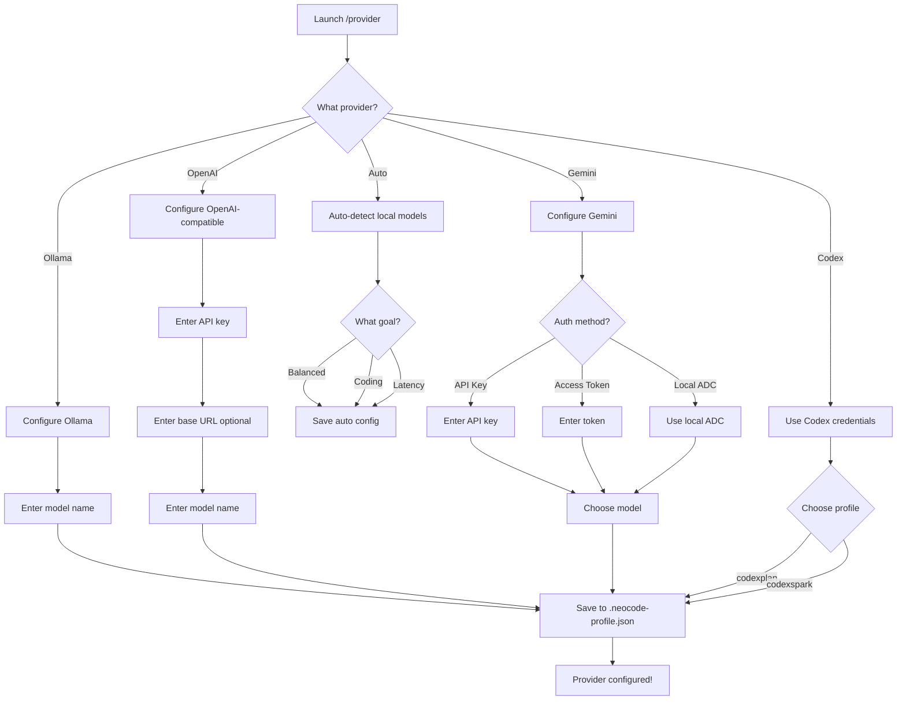

# NeoCode User Guide

Complete guide to using NeoCode effectively, from basics to advanced features.

---

## Table of Contents

1. [Getting Started](#getting-started)
2. [Basic Usage](#basic-usage)
3. [Navigation Flows](#navigation-flows)
4. [Core Features](#core-features)
5. [Slash Commands Reference](#slash-commands-reference)
6. [Advanced Workflows](#advanced-workflows)
7. [Tips & Best Practices](#tips--best-practices)
8. [Troubleshooting](#troubleshooting)

---

## Getting Started

### First Launch

When you first run `neocode`, you'll see:

1. **Welcome Screen** - NeoCode banner and version info
2. **Provider Check** - Checks for configured AI provider
3. **Setup Prompt** - If no provider is configured, prompts for setup

### Initial Setup Flow

```
┌─────────────────────────────────────┐
│  Launch: neocode                    │
├─────────────────────────────────────┤
│  → No provider configured?          │
│     → Run /provider                 │
│     → Select provider type          │
│     → Enter credentials             │
│     → Choose model                  │
│     → Save to profile               │
├─────────────────────────────────────┤
│  → Provider configured              │
│     → Ready to use!                 │
└─────────────────────────────────────┘
```

### Quick Setup Commands

```bash
# Interactive provider setup
/provider

# View help
/help

# Check installation
/doctor
```

---

## Basic Usage

### Asking Questions

Simply type your question and press Enter:

```
How do I read a file in Python?
```

NeoCode will:
1. Process your question
2. Generate a response using your configured AI model
3. Stream the answer to your terminal

### Running Commands

NeoCode has **two types of commands**:

1. **Slash Commands** - Start with `/` (e.g., `/help`, `/provider`)
2. **Natural Language** - Regular questions and requests

### Example Session

```
> What files are in this directory?

[NeoCode reads directory and responds]

> Can you explain what main.py does?

[NeoCode reads main.py and explains]

> /help

[Opens help menu]
```

---

## Navigation Flows

### Provider Setup Flow



### Memory System Flow

```mermaid
graph TD
    Start[Memory System] --> Type{Action type?}

    Type -->|View/Edit| ViewMem[/memory]
    ViewMem --> Select[Select memory file]
    Select --> Edit[Edit in $EDITOR]

    Type -->|Search| Search[/memory search query]
    Search --> Results[Display matches]

    Type -->|Enable Palace| Enable[/memory palace on]
    Enable --> AutoConsolidate[Auto-consolidate sessions]

    Type -->|Manual Consolidation| Dream[/dream]
    Dream --> Consolidate[Consolidate recent sessions]
    Consolidate --> SaveMem[Save to Memory Palace]

    Type -->|View Graph| Graph[/memory graph]
    Graph --> ShowGraph[Display memory graph structure]
```

### Voice Input Flow

```mermaid
graph TD
    Start[/voice] --> Check{Dependencies OK?}
    Check -->|No| Install[Install dependencies]
    Install --> Auth{Authenticated?}

    Check -->|Yes| Auth
    Auth -->|No| Login[/login or set WHISPER_BASE_URL]
    Login --> MicPerm{Mic permission?}

    Auth -->|Yes| MicPerm
    MicPerm -->|No| RequestPerm[Request mic access]
    RequestPerm --> Enable[Voice enabled]

    MicPerm -->|Yes| Enable
    Enable --> Use[Hold Space to talk]
    Use --> Transcribe[Transcribe speech]
    Transcribe --> Process[Send to AI]
```

### Permission Management Flow

```mermaid
graph TD
    Start[/permissions] --> View[View current rules]
    View --> Action{What to do?}

    Action -->|Add Allow| AddAllow[Add allow rule]
    AddAllow --> SelectTool[Select tool]
    SelectTool --> Pattern[Define pattern]
    Pattern --> SaveAllow[Save allow rule]

    Action -->|Add Deny| AddDeny[Add deny rule]
    AddDeny --> SelectTool2[Select tool]
    SelectTool2 --> Pattern2[Define pattern]
    Pattern2 --> SaveDeny[Save deny rule]

    Action -->|Remove Rule| Remove[Select rule to remove]
    Remove --> ConfirmRemove[Confirm removal]

    Action -->|Retry Denied| Retry[Select denied tool use]
    Retry --> RetryExec[Re-execute with permission]
```

---

## Core Features

### 1. Provider Management

Configure and switch between AI providers.

**Command:** `/provider`

**Supported Providers:**
- **Auto** - Auto-detect best local model
- **Ollama** - Local models (no API key)
- **OpenAI-compatible** - OpenAI, DeepSeek, OpenRouter, Groq, etc.
- **Gemini** - Google Gemini API
- **Codex** - ChatGPT Codex CLI
- **GitHub Models** - Use `/onboard-github`

**Example Workflow:**
```
1. Type: /provider
2. Select: Ollama
3. Enter model: qwen2.5-coder:7b
4. Confirm: Save profile
5. ✓ Ready to use!
```

---

### 2. Memory System

Persistent memory across conversations.

#### Memory Files

**Command:** `/memory`

Opens interactive file selector to edit:
- `project-memory.md` - Project-specific context
- `guidance.md` - Task-specific instructions
- `session-memory.md` - Current session context

#### Memory Palace

**Enable:** `/memory palace on`
**Disable:** `/memory palace off`

Features:
- Automatic memory consolidation
- Hierarchical organization (Wings → Rooms)
- Knowledge graph with semantic search
- Background processing via KAIROS daemon

#### Manual Consolidation

**Command:** `/dream`

Manually trigger memory consolidation:
- Reads recent sessions
- Synthesizes key insights
- Saves to Memory Palace
- Updates knowledge graph

#### Search Memories

**Command:** `/memory search <query>`

```
/memory search "authentication flow"
/memory search "API endpoints"
```

#### View Memory Graph

**Command:** `/memory graph`

Shows:
- Total nodes and connections
- Memory structure overview
- Wing and room organization

---

### 3. Background Tasks (BTW)

Ask side questions without interrupting main conversation.

**Command:** `/btw <question>`

**Example:**
```
> /btw What's the syntax for Python list comprehension?

[Response appears in overlay - doesn't affect main conversation]
```

**View History:**
```
/btw list
```

**Keyboard Controls:**
- **↑/↓** or **Ctrl+P/Ctrl+N** - Scroll
- **Space/Enter/Esc** - Dismiss

---

### 4. Project Wiki

Local documentation system for projects.

#### Initialize Wiki

```
/wiki init
```

Creates `.neocode/wiki/` with:
- `schema.yaml` - Wiki structure
- `index.md` - Main index
- `sources/` - Source files
- `pages/` - Wiki pages
- `ingest.log` - Ingestion history

#### Check Status

```
/wiki status
```

Shows:
- Page count
- Source count
- Last updated

#### Ingest Files

```
/wiki ingest README.md
/wiki ingest docs/API.md
```

---

### 5. Voice Input

Hands-free coding with voice commands.

**Toggle Voice:** `/voice`

**Requirements:**
- Microphone access
- Claude.ai login OR Whisper endpoint

**Usage:**
1. Enable voice mode: `/voice`
2. Hold **Space** to talk
3. Release to send
4. NeoCode transcribes and processes

**Configure Whisper (optional):**
```bash
export WHISPER_BASE_URL=http://localhost:9000
```

---

### 6. MCP Servers

Manage Model Context Protocol servers for external tool integration.

**Command:** `/mcp`

**Actions:**
- Enable/disable servers
- Reconnect to servers
- View server status

**Examples:**
```
/mcp enable                # Enable all servers
/mcp enable filesystem     # Enable specific server
/mcp disable               # Disable all servers
/mcp reconnect filesystem  # Reconnect to server
```

---

### 7. Sandbox Mode

Isolate bash commands in Docker containers for safety.

**Command:** `/sandbox`

**Features:**
- Run untrusted commands safely
- Configure auto-allow in sandbox
- Exclude specific commands
- Fallback to unsandboxed on failure

**Example:**
```
/sandbox exclude "npm run test:*"
```

**Platform Support:**
- ✅ macOS, Linux, WSL2
- ❌ Windows (native), WSL1

---

### 8. Permissions

Control which tools AI can use.

**Command:** `/permissions`

**Features:**
- **Allow Rules** - Explicitly permit tools
- **Deny Rules** - Block specific tools
- **Pattern Matching** - Use wildcards in rules
- **Retry Denied** - Re-run blocked commands

**Use Cases:**
```
# Block file writes to /etc
Allow: BashTool, ReadTool
Deny: WriteTool (pattern: /etc/*)

# Prevent destructive git commands
Deny: BashTool (pattern: git push --force*)
```

---

## Slash Commands Reference

### Essential Commands

| Command | Description |
|---------|-------------|
| `/help` | Show help and available commands |
| `/provider` | Manage AI provider profiles |
| `/memory` | Manage memory files and Memory Palace |
| `/dream` | Consolidate memories from recent sessions |
| `/btw <question>` | Ask side question (non-blocking) |
| `/wiki [init\|status]` | Manage project wiki |
| `/voice` | Toggle voice input mode |
| `/mcp` | Manage MCP servers |
| `/sandbox` | Configure command sandboxing |
| `/permissions` | Manage tool permission rules |
| `/doctor` | Run system diagnostics |
| `/exit` | Exit NeoCode |

### Session Management

| Command | Description |
|---------|-------------|
| `/clear` | Clear screen |
| `/session` | View session info |
| `/resume` | Resume previous session |
| `/context` | View context size and tokens |
| `/compact` | Compress context to save tokens |
| `/export` | Export conversation |

### Configuration

| Command | Description |
|---------|-------------|
| `/config` | Edit settings |
| `/theme` | Change terminal theme |
| `/model` | Change AI model |
| `/fast` | Switch to fast model preset |
| `/privacy-settings` | Configure privacy options |
| `/hooks` | Manage lifecycle hooks |
| `/keybindings` | Configure keyboard shortcuts |

### Development

| Command | Description |
|---------|-------------|
| `/diff` | Show git diff |
| `/files` | List project files |
| `/stats` | Show usage statistics |
| `/cost` | View API cost estimates |
| `/plan` | Plan mode for complex tasks |
| `/review` | Code review mode |

### Advanced

| Command | Description |
|---------|-------------|
| `/agents` | Manage agent swarm |
| `/skills` | Manage skills and capabilities |
| `/swarm` | Configure agent swarm settings |
| `/research` | Research mode for information gathering |
| `/computer-use` | Enable computer use (screenshot/mouse/keyboard) |

---

## Advanced Workflows

### Multi-Provider Setup

Use different providers for different tasks:

**Example: Cost Optimization**

```json
// ~/.claude/settings.json
{
  "agentModels": {
    "deepseek-chat": {
      "base_url": "https://api.deepseek.com/v1",
      "api_key": "sk-your-key"
    },
    "gpt-4o": {
      "base_url": "https://api.openai.com/v1",
      "api_key": "sk-your-key"
    }
  },
  "agentRouting": {
    "Explore": "deepseek-chat",
    "Plan": "gpt-4o",
    "general-purpose": "gpt-4o",
    "default": "gpt-4o"
  }
}
```

This routes:
- Exploration tasks → DeepSeek (cheaper)
- Planning tasks → GPT-4o (better reasoning)

---

### Custom Slash Commands

Create project-specific commands in `.claude/commands/`:

**Example: `.claude/commands/test.md`**
```markdown
Run the test suite and report failures in detail
```

Usage:
```
/test
```

---

### Hooks and Automation

Configure lifecycle hooks in `~/.claude/settings.json`:

```json
{
  "hooks": {
    "beforeToolCall": {
      "bash": "echo 'Running: {command}' >> audit.log"
    },
    "afterWrite": {
      "*": "bun run lint {filePath}"
    }
  }
}
```

---

### Memory Palace Strategy

**Best Practices:**

1. **Enable Memory Palace Early**
   ```
   /memory palace on
   ```

2. **Consolidate Regularly**
   ```
   /dream
   ```

3. **Review Memory Graph**
   ```
   /memory graph
   ```

4. **Search Before Asking**
   ```
   /memory search "how we implemented auth"
   ```

---

### Agent Swarm Orchestration

Use hierarchical agents for complex tasks:

```
/agents

Select swarm configuration:
- Coordinator → Delegates tasks
- Specialists → Execute specific domains
- Reviewers → Quality control
```

**Example Flow:**
```
1. Coordinator receives: "Build authentication system"
2. Delegates to:
   - Backend Specialist → API endpoints
   - Frontend Specialist → Login UI
   - Security Specialist → Token handling
3. Reviewer validates implementation
4. Coordinator synthesizes results
```

---

## Tips & Best Practices

### Effective Prompting

**❌ Vague:**
```
Fix the bug
```

**✅ Specific:**
```
The login form crashes when I submit empty credentials.
Check LoginForm.tsx and add validation.
```

---

### Context Management

**Monitor Context:**
```
/context
```

**Compress When Needed:**
```
/compact
```

**Start Fresh:**
```
/clear
```

---

### Provider Selection

| Use Case | Recommended Provider |
|----------|---------------------|
| **Cost-effective** | Ollama (free, local) |
| **Best quality** | OpenAI GPT-4o |
| **Fast iteration** | Ollama llama3.2:3b |
| **Coding tasks** | Ollama qwen2.5-coder:7b |
| **Privacy-first** | Ollama (no data sent) |
| **Vision tasks** | OpenAI GPT-4o, Gemini |

---

### Keyboard Shortcuts

Default shortcuts (configurable via `/keybindings`):

| Key | Action |
|-----|--------|
| **Ctrl+C** | Cancel current operation |
| **Ctrl+D** | Exit NeoCode |
| **Space** | Push-to-talk (voice mode) |
| **↑/↓** | Navigate history |
| **Tab** | Command autocomplete |

---

### Performance Optimization

**For Slow Responses:**

1. Use faster model:
   ```
   /model llama3.2:3b
   ```

2. Reduce context:
   ```
   /compact
   ```

3. Use local Ollama:
   ```
   /provider → Ollama
   ```

---

## Troubleshooting

### Common Issues

#### "Provider not configured"

**Solution:**
```
/provider
```
Follow setup wizard.

---

#### "ripgrep not found"

**Solution:**

macOS:
```bash
brew install ripgrep
```

Ubuntu:
```bash
sudo apt install ripgrep
```

Windows:
```powershell
winget install BurntSushi.ripgrep.MSVC
```

---

#### "Failed to connect to Ollama"

**Solution:**
```bash
ollama serve
```

Then restart NeoCode.

---

#### "Out of memory" or Slow Performance

**Solution:**

1. Compact context:
   ```
   /compact
   ```

2. Switch to smaller model:
   ```
   /model llama3.2:3b
   ```

3. Start new session:
   ```
   /clear
   ```

---

#### Voice Mode Not Working

**Checks:**

1. Microphone permissions granted?
2. Logged in to Claude.ai OR Whisper endpoint configured?
3. Recording tools installed (SoX on Linux)?

**Solution:**
```
/doctor
```

Check "Voice Input" section.

---

### Getting Help

1. **Built-in Help:**
   ```
   /help
   ```

2. **System Diagnostics:**
   ```
   /doctor
   ```

3. **Community:**
   - [GitHub Discussions](https://github.com/LHenri88/NeoCode/discussions)
   - [GitHub Issues](https://github.com/LHenri88/NeoCode/issues)

4. **Documentation:**
   - [Installation Guide](INSTALLATION.md)
   - [Commands Reference](COMMANDS.md)
   - [Architecture](ARCHITECTURE.md)

---

## Next Steps

After mastering the basics:

1. **Explore Advanced Features**
   - Agent swarm orchestration
   - Computer use (screenshot/mouse/keyboard)
   - Custom plugins and MCP servers

2. **Optimize Your Workflow**
   - Set up custom slash commands
   - Configure hooks for automation
   - Create provider routing strategies

3. **Contribute**
   - Share tips in [Discussions](https://github.com/LHenri88/NeoCode/discussions)
   - Report bugs or request features
   - Contribute code (see [CONTRIBUTING.md](../CONTRIBUTING.md))

---

**Happy Coding with NeoCode!** 🚀